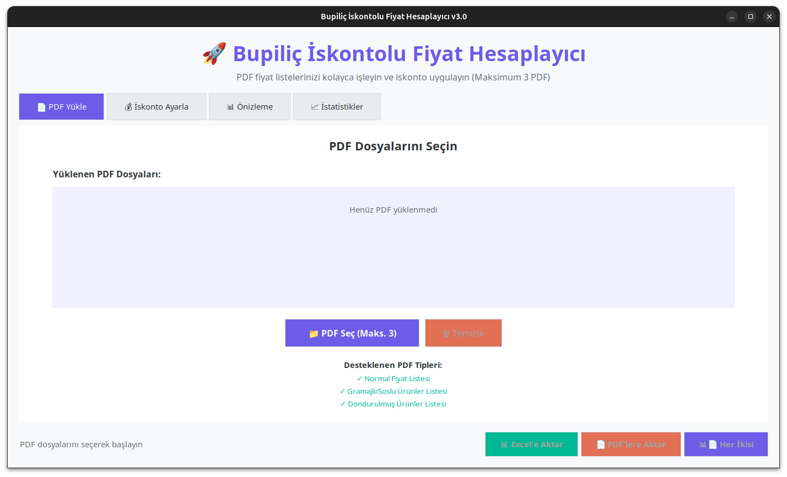

# BUP-İskonto Hesabı

BUP-İskonto Hesabı, Bupiliç ürünlerinin iskonto hesaplamalarını hızlı ve pratik bir şekilde yapabilmenizi sağlayan bir masaüstü uygulamasıdır. Python ile geliştirilmiş olup, Windows ortamında çalıştırılabilir bir sürümü de mevcuttur.

---

## Özellikler

- **Hızlı hesaplama:** Ürün fiyatlarını ve iskontoları kolayca hesaplayabilirsiniz.
- **Farklı ürün tipleri:** Taze, dökme ve tabaklı ürünleri destekler.
- **İskonto yönetimi:** Birden fazla iskonto senaryosunu hızlıca karşılaştırabilirsiniz.
- **Kullanıcı dostu arayüz:** Basit ve anlaşılır bir kullanıcı arayüzü.
- **Windows çalıştırılabilir dosya:** Python yüklü olmasa da uygulamayı kullanabilirsiniz.
- **Ekran görüntüsü ve kullanım videosu:** Uygulamanın işleyişini görebilirsiniz.

---

## Ekran Görüntüsü ve Video

### Gif Demo


### Ekran Görüntüleri
  
*Uygulamanın temel arayüz görünümü.*

---

## Kurulum

### Windows Kullanımı (Önerilen)
1. [Windows için exe dosyasını buradan indirin](https://github.com/alibedirhan/BUP-Iskonto-Hesabi/releases/latest)  
2. İndirilen dosyayı açarak programı başlatın.  

### Python ile Kullanım
Eğer Windows exe yerine Python üzerinden çalıştırmak isterseniz:

```bash
git clone https://github.com/alibedirhan/BUP-Iskonto-Hesabi.git
cd BUP-Iskonto-Hesabi
python -m venv venv
source venv/bin/activate  # Windows için: venv\Scripts\activate
pip install -r requirements.txt
python main.py
